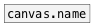
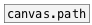

[< reference home](ceammc_lib.html)
---

# canvas.dir


current canvas directory

---

<br>


---


```


[B]
|
[canvas.dir] [B]
|             |
[ui.display   ]

            
```

---
arguments:


---
properties:


---
see also:<br>
[](canvas.name.html)
[](canvas.path.html)
