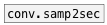

[< reference home](ceammc_lib.html)
---

# conv.sec2samp


convert time in seconds to number of samples according to current
            samplerate

---

<br>


---


```


[1(  [1 1.5 2.9(
|    |
[sec->samp]
|
[msg set]
|
[ (

            
```

---
arguments:


---
properties:


---
see also:<br>
[](conv.samp2sec.html)
