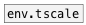
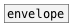

[< reference home](ceammc_lib.html)
---

# env.vscale


Envelope value-scale

---

<br>


---


```


[ar 20 30, bang(
|
[envelope] [@scale 0.5( [@scale 1.5(
|          |            |
|          |            |
|          |            |
[env.vscale          0.9]
|
[env->array vscale_array @raw]


[array vscale_array size=10000 w=300 h=100 yr=0..1]

            
```

---
arguments:

SCALE: value-scale<br>

---
properties:

@scale: value-scale<br>

---
see also:<br>
[](env.tscale.html)
[](envelope.html)
