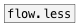

[< reference home](ceammc_lib.html)
---

# flow.less_eq


numeric stream router, like many [moses]

---

Numbers thar are *less equal* then N-th argument are passed to N-th inlet<br>


---


```


[F]
|
|
|
[flow.less_eq 0 10 20 30   ]
|     ^|   ^^|   ^^^|  ^^^^|
[F]   [F]   [F]   [F]    [F]

            
```

---
arguments:

LIST: compare values: list of floats in ascending
            order<br>

---
properties:


---
see also:<br>
[](flow.less.html)
