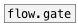

[< reference home](ceammc_lib.html)
---

# flow.once


one message pass thru

---

<br>


---


```


[F]       [reset(
|         |
[flow.once]
|
[F]

            
```

---
arguments:


---
properties:


---
see also:<br>
[](flow.gate.html)
