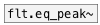

[< reference home](ceammc_lib.html)
---

# flt.c_peak~


Peaking equalizer calculator for biquad

---

Calculates coefficients for transfer function: H(z)=(b0 + b1*z⁻¹ + b2*z⁻²)/(1 +
            a1*z⁻¹ + a2*z⁻²)<br>


---


```


[noise.pink~]
|
|        [F]        [F]
|        |          |
|        [@freq $1( [@gain $1(
|        |          |
|        [flt.c_peak~      200 15 10]
|        |  ^|   ^^|    ^^^|     ^^^^|
|        |.  |..   |...    |....     |.....
[flt.biquad~                               ]
|
[ui.gain~ @size 120 16]
|\
[dac~]

[ui.dsp~]

            
```

---
arguments:

freq(Hz): center
            frequency<br>
gain(db): filter
            gain<br>
q: quality
            factory<br>

---
properties:

@freq(Hz): center frequency<br>
@gain(db): filter gain<br>
@q: quality
            factor: @freq/BANDWIDTH<br>
@active: on/off dsp
            processing<br>

---
see also:<br>
[](flt.eq_peak~.html)
[](flt.biquad~.html)
