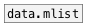

[< reference home](ceammc_lib.html)
---

# global.mlist


global named mlist object

---

Defines global scope mlist variable, accessed by ID name<br>


---


```


[\(1 2 3 \(a b c\)\), bang( [bang(
|                           |
[ml]                        [global.mlist l1]
|                           |
[global.mlist l1]           [ui.display @display_type=1]
|
[ui.display @display_type=1]

            
```

---
arguments:

ID: object ID<br>

---
properties:

@empty: 1 if list is
            empty, otherwise 0<br>
@size: number of
            elements in list<br>

---
see also:<br>
[](data.mlist.html)
[](local.mlist.html)
