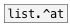
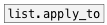

[< reference home](ceammc_lib.html)
---

# list.at


on input list outputs element(s) at specified index(es)

---

Returns the element at the given index position in the list.@rel property allows to acess elements in range (-LIST_SIZE, LIST_SIZE). Negative
            index means position from the end of the list. For example: -1 returns last
            element.@clip property: if element index &lt; 0 - first element returned. If element index
            &gt;= LIST_SIZE last element returned.@wrap property: in range [0, LIST_SIZE) ordinal elements are returned. Other
            indexes are wrapped by modulo division.<br>


---


```


[1 2 3 4 5( [F]  [1 2 3 4 5( [F]
|           |.   |           |.
[list.at -1  ]   [list.at @clip]
|                |
[F]              [F]


[1 2 3 4 5( [F]  [1 2 3 4 5( [F]
|           |.   |           |.
[list.at @wrap]  [list.at @fold]
|                |
[F]              [F]

[list A B C D E(
|
[list.at -1 1 3]
|
[msg set]
|
[ (

            
```

---
arguments:

position: single or multiple elements position<br>

---
properties:

@method: methods
            of processing of negative/invalid indexes<br>
@rel: alias to @method rel. Negative index means position
            from the end of the list<br>
@clip: alias to @method clip. If index &lt; 0 - return
            first element. If index greater or equal list size - return last element<br>
@fold: alias to @method fold. In range [0, LIST_SIZE)
            ordinal elements are returned. [LIST_SIZE, 2*LIST_SIZE) - returned in negative order
            etc.<br>
@wrap: alias to @method wrap. In range [0, LIST_SIZE)
            ordinal elements are returned. Other indexes are wrapped by modulo division.<br>
@index: indexes<br>
@default: default output value if not found. If not set,
            outputs error message to console<br>

---
see also:<br>
[](list.^at.html)
[](list.apply_to.html)
