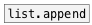

[< reference home](ceammc_lib.html)
---

# list.insert


insert atom or list to the specified position of input list

---

Works with data atoms<br>


---


```


[1 2 3 4(
|
|  [list D E F(  [F]
|  |             |
|  |.            |..
[list.insert A B C @index 1]
|
[ui.display @display_type=1]

            
```

---
arguments:


---
properties:

@index: insert element
            index<br>

---
see also:<br>
[](list.append.html)
[](list.prepend.html)
