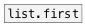
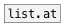

[< reference home](ceammc_lib.html)
---

# list.last


returns last list element

---

<br>


---


```


[1 60 120 b 11( [list a b( [\(a b c\), bang(
|               |          |
|               |          [ml]
|               |          |
[list.last                 ]
|
[msg set]
|
[ (

            
```

---
arguments:


---
properties:


---
see also:<br>
[](list.first.html)
[](list.at.html)
