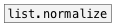

[< reference home](ceammc_lib.html)
---

# list.mean


calculates average of list of floats

---

<br>


---


```


[1 2 3 4 5( [1 2 a b c(
|           |
|           |
[list.mean  ]
|
[F]

            
```

---
arguments:


---
properties:


---
see also:<br>
[](list.normalize.html)
