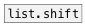

[< reference home](ceammc_lib.html)
---

# list.stretch


stretches list - changes its size with linear interpolation

---

<br>


---


```


[ui.sliders]
|
|
|
|
|
|
|
|            [F]
|            |.
[list.stretch 32]
|
[ui.sliders @count 32]
|
|
|
|
|
|
|
[print]

            
```

---
arguments:

stretch: New size of output list. Input list
            will be stretched to the new size with linear interpolation<br>

---
properties:

@size: new size<br>

---
see also:<br>
[](list.shift.html)
