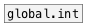

[< reference home](ceammc_lib.html)
---

# local.float


canvas-scoped named float variable

---

Defines named local float variable, accessed by name and available only within its
            patch (canvas). Note: it is not accessible even from subpatch.<br>


---


```


[F]   [+ 2, bang(    [* 3, bang(    [bang(
|     |              |              |
|     |              |              |
|     |  [- 3, bang( | [/ 2, bang(  |
|     |  |           | |            |
|     |  |           | |            |
|     |  |           | |            |
[local.float         f1]            [local.float f1]
|                                   |
[F]                                 [F]

            
```

---
arguments:

ID: object ID<br>

---
properties:

@value: current
            value<br>

---
see also:<br>
[](local.int.html)
[](global.int.html)
