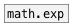

[< reference home](ceammc_lib.html)
---

# math.log


natural logarithm

---

Computes the value of the natural logarithm of argument x.Special values:log(+-0) return -infinitylog(1) return +0.log(x) return a NaNlog(+infinity) return +infinity.<br>


---


```


[bang(                  [array LOG yr=-4..4 w=320]
|
[list.seq -1 16 0.125]
|
[math.log]
|
[list->array LOG]

            
```

---
arguments:


---
properties:


---
see also:<br>
[](math.exp.html)
