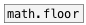
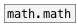

[< reference home](ceammc_lib.html)
---

# math.trunc


truncate to integer value

---

Outputs the integral value nearest to but no larger in magnitude than x<br>


---


```


[bang(                 [array TRUNC yr=-4..4 w=320]
|
[list.seq -4 4 0.025]
|
[math.trunc]
|
[list->array TRUNC]

            
```

---
arguments:


---
properties:


---
see also:<br>
[](math.ceil.html)
[](math.floor.html)
[](math.round.html)
[](math.math.html)
