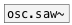
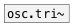
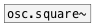
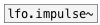

[< reference home](ceammc_lib.html)
---

# osc.impulse~


Bandlimited impulse train generator

---

<br>


---


```


[F]
|
[osc.impulse~ 20]
|
[ui.gain~ @size 120 16]
|\
[dac~]

[ui.dsp~]

            
```

---
arguments:

freq(Hz): frequency<br>

---
properties:

@active: on/off dsp
            processing<br>

---
see also:<br>
[](osc.saw~.html)
[](osc.tri~.html)
[](osc.square~.html)
[](lfo.impulse~.html)
