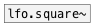

[< reference home](ceammc_lib.html)
---

# osc.square~


Bandlimited square wave oscillator

---

<br>


---


```


[F]        [ui.dsp~]
|
[$1 50(
|
[line~]     [bang(
|           |.
[osc.square~]
|
[ui.gain~ @size 120 14]
|\       |
[dac~]   [ui.scope~]


            
```

---
arguments:

freq(Hz): frequency<br>

---
properties:

@active: on/off dsp
            processing<br>

---
see also:<br>
[](osc.saw~.html)
[](osc.tri~.html)
[](lfo.square~.html)
