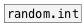

[< reference home](ceammc_lib.html)
---

# random.float


random float generator in specified range

---

generates a random floating-point value uniformly distributed in the range
            [min..max)<br>


---


```


[B]
|
|
|
[random.float 1 3]
|
[F]

            
```

---
arguments:

MIN: random range lower bound<br>
MAX: random range upper bound<br>

---
properties:

@min: random range lower bound<br>
@max: random range upper bound<br>

---
see also:<br>
[](random.int.html)
[](random.gauss.html)
