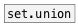

[< reference home](ceammc_lib.html)
---

# set.diff


difference between two sets

---

<br>


---


```


[B]
|
[data.set 1 2 3 4 5 6]
|
[set.diff 2 4 6]
|
[set->list @sort]
|
[msg set]
|
[ (

            
```

---
arguments:

ARGS: right set elements<br>

---
properties:


---
see also:<br>
[](data.set.html)
[](set.union.html)
