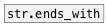

[< reference home](ceammc_lib.html)
---

# string.contains


checks if given string contains specified substring

---

<br>


---


```


[B]
|
[string test] [symbol message(  [symbol simple(
|             |                 |
|             |                 |
|             |                 |
[str.contains                 es]
|
[T]

            
```

---
arguments:

SUBSTR: searched substring<br>

---
properties:


---
see also:<br>
[](str.ends_with.html)
