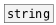

[< reference home](ceammc_lib.html)
---

# string.equal


check strings for equality

---

<br>


---


```


[B]
|
[string Chuck] [symbol Chuck?(
|              |
[string.equal Chuck]
|
[T]

            
```

---
arguments:

STR: second string initial value<br>

---
properties:


---
see also:<br>
[](string.html)
