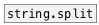

[< reference home](ceammc_lib.html)
---

# string.join


joins (concatenates) strings with separator

---

<br>


---


```


[bang(
|
[string TEST]
|
[string.split]
|
[string.join ' ']
|
[ui.d @display_type=1]

            
```

---
arguments:

SEP: separator. For space use &#39; &#39;.<br>

---
properties:

@sep: separator<br>

---
see also:<br>
[](string.split.html)
