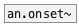

[<<< reference home](ceammc_lib.md)
---

# an.onset

```


[symbol #s(           [B] [array AONSET w=380 h=100]
|                     |
[expand_env]  [openpanel]
|             |
[load $1 to AONSET @resize(
|
[snd.file]
|
[b] [shuffle, bang #r(    [$1 #m(
|                         |
[an.onset #a]  [T] [F #f] [array.s->p AONSET]
|              |   |.     |
[data.list #l] [metro 70] [ui.hsl @size 16 380]
|              |
[list.walk @fold]         [r off            #r1][F]
|                         |                 |     |
[pack f f  #p]            [tabplay~ AONSET] [b] [@release $1 #ar(
|                         |                 |   |
[ms->samp]                [env.ar~ 10 500       ]
|                         |
[s off]                   [ui.hgain~]
                          |\
[ui.dsp~]                 [dac~]
[X f->p:1] [X r->l] [X f->ar] [X r1->m]
#a AONSET
#s %DOC%/sound/voice.wav

            
```
---
onset detector for arrays
---
arguments:

ARRAY: array name<br>
BS(samp): buffer size<br>
METHOD: overlap of analysis frames<br>
HS: hop size (by default
            buffer_size/2)<br>

---
properties:

@array: name of analyzed array<br>
@bs(samp): buffer
            size<br>
@hs(samp): hop size. 0
            means @bs/2<br>
@method: onset method. Default is hfc.<br>
@hfc: alias to @method hfc. High Frequency Content onset
            detection<br>
@energy: alias to @method energy. Energy based onset
            detection function<br>
@complex: alias to @method complex. Complex Domain Method
            onset detection function<br>
@phase: alias to @method phase. Phase Based Method onset
            detection function<br>
@wphase: alias to @method phase.Weighted Phase Deviation
            onset detection function<br>
@specdiff: alias to @method specdiff. Spectral difference
            method onset detection function<br>
@kl: alias to @method kl. Kullback-Liebler onset detection
            function<br>
@mkl: alias to @method mkl. Modified Kullback-Liebler
            onset detection function<br>
@specflux: alias to @method specflux. Spectral
            Flux<br>
@threshold: peak picking
            threshold<br>
@speedlim(ms): 
            minimum interval between two consecutive onsets<br>
@silence(db): onset detection silence threshold<br>
@compression: lambda logarithmic
            compression factor, 0 to disable<br>
@awhitening: adaptive
            whitening<br>
@delay(ms): constant system delay to take back from detection time<br>

---
see also:<br>
[](an.onset~.md)
