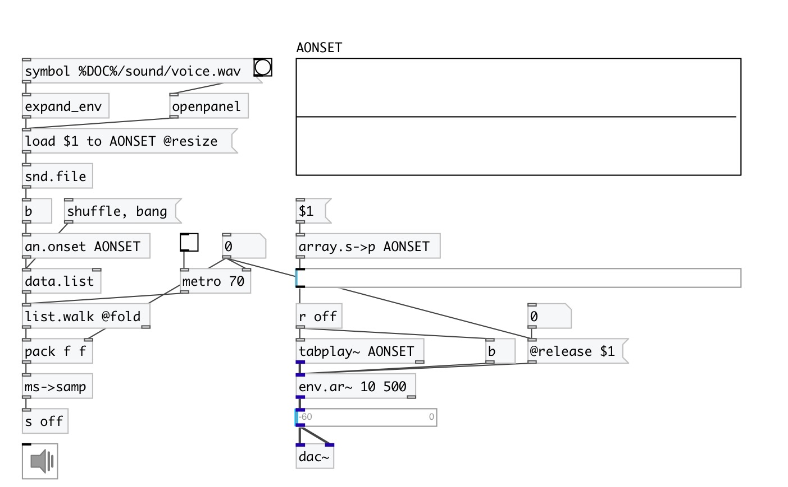

[index](index.html) :: [an](category_an.html)
---

# an.onset

###### onset detector for arrays

*available since version:* 0.9

---

## information
Onset detector based on aubio library

## arguments:

* **ARRAY**
array name 
_type:_ symbol 

* **BS**
buffer size 
_type:_ int 
_units:_ samp 

* **METHOD**
detection method 
_type:_ symbol 

* **HS**
hop size (by default buffer_size/2) 
_type:_ int 

## properties:

* **@array** 
Get/set name of analyzed array 
_type:_ symbol 

* **@bs** 
Get/set buffer size 
_type:_ int 
_units:_ samp 
_min value:_ 64 
_default:_ 1024 

* **@hs** 
Get/set hop size. 0 means @bs/2 
_type:_ int 
_units:_ samp 
_min value:_ 0 
_default:_ 0 

* **@method** 
Get/set onset method. Default is hfc. 
_type:_ symbol 
_enum:_ specflux, phase, energy, hfc, kl, complex, default, specdiff, wphase, rolloff, spread, kurtosis, skewness, complexdomain, decrease, slope, centroid 
_default:_ default 

* **@hfc** 
Get/set alias to @method hfc. High Frequency Content onset detection 
_type:_ alias 

* **@energy** 
Get/set alias to @method energy. Energy based onset detection function 
_type:_ alias 

* **@complex** 
Get/set alias to @method complex. Complex Domain Method onset detection function 
_type:_ alias 

* **@phase** 
Get/set alias to @method phase. Phase Based Method onset detection function 
_type:_ alias 

* **@wphase** 
Get/set alias to @method phase. Weighted Phase Deviation onset detection function 
_type:_ alias 

* **@specdiff** 
Get/set alias to @method specdiff. Spectral difference method onset detection function 
_type:_ alias 

* **@kl** 
Get/set alias to @method kl. Kullback-Liebler onset detection function 
_type:_ alias 

* **@mkl** 
Get/set alias to @method mkl. Modified Kullback-Liebler onset detection function 
_type:_ alias 

* **@specflux** 
Get/set alias to @method specflux. Spectral Flux 
_type:_ alias 

* **@threshold** 
Get/set peak picking threshold 
_type:_ float 
_default:_ 0.058 

* **@speedlim** 
Get/set minimum interval between two consecutive onsets 
_type:_ float 
_units:_ ms 
_min value:_ 1 
_default:_ 50 

* **@silence** 
Get/set onset detection silence threshold 
_type:_ float 
_units:_ db 
_range:_ -80..0 
_default:_ -70 

* **@compression** 
Get/set lambda logarithmic compression factor, 0 to disable 
_type:_ float 
_min value:_ 0 
_default:_ 1 

* **@awhitening** 
Get/set adaptive whitening 
_type:_ int 
_enum:_ 0, 1 
_default:_ 0 

* **@delay** 
Get/set constant system delay to take back from detection time 
_type:_ float 
_units:_ ms 
_min value:_ 0 
_default:_ 49.9093 

## inlets:

* analyze array 
_type:_ control

## outlets:

* output list of detected onsets 
_type:_ control

## keywords:

[onset](keywords/onset.html)

**See also:**
[\[an.onset~\]](an.onset~.html)

**Authors:** Serge Poltavsky

**License:** GPL3 or later

