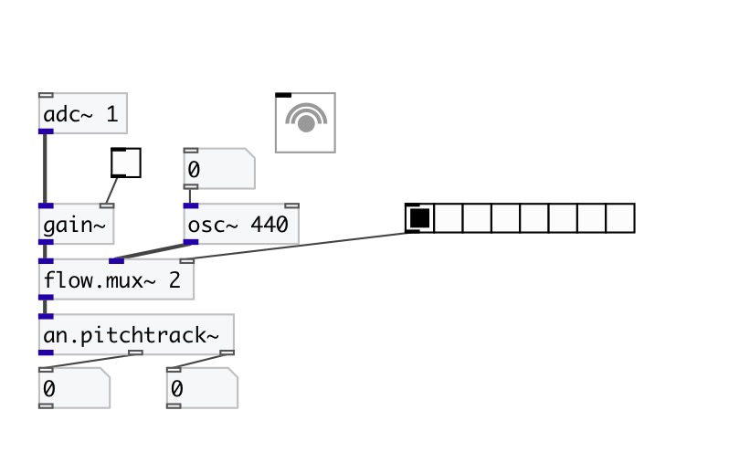

[< reference home](index.html)
---

# an.pitchtrack~

pitch tracker

---

Period-length detector using Philip McLeod&#39;s Specially Normalized AutoCorrelation
            function (SNAC)
 

---

---
arguments:

FRAME: frame size in
            samples 
OVERLAP: overlap of analysis
            frames 

---
properties:

@framesize(samp): frame size in samples 
@overlap: overlap of analysis
            frames 
@bias: bias which
            favours small lags over large lags in the period detection, thereby avoiding low-octave
            jumps 
@fidthr: min
            fidelity threshold to report the pitch 
@maxfreq(Hz): max tracked frequency 

---
see also: 

