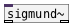
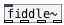

[<<< reference home](ceammc_lib.md)
---

# an.pitchtrack~

```


[adc~ 1]     [ui.dsp~]
|
|   [T] [F]
|   |.  |
[gain~] [osc~ 440]  [hradio]
|       |.          |..
[flow.mux~           2]
|
[an.pitchtrack~]
^|     ^^|
[F]    [F]

            
```
---
pitch tracker
---
arguments:

FRAME: frame size in
            samples<br>
OVERLAP: overlap of analysis
            frames<br>

---
properties:

@framesize(samp): frame size in samples<br>
@overlap: overlap of analysis
            frames<br>
@bias: bias which
            favours small lags over large lags in the period detection, thereby avoiding low-octave
            jumps<br>
@fidthr: min
            fidelity threshold to report the pitch<br>
@maxfreq(Hz): max tracked frequency<br>

---
see also:<br>
[](sigmund~.md)
[](fiddle~.md)
