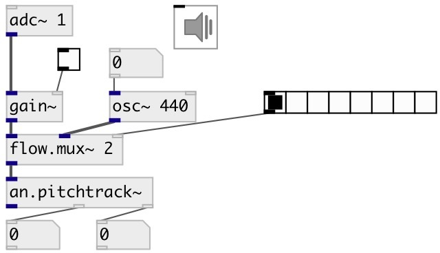

[index](index.html) :: [an](category_an.html)
---

# an.pitchtrack~

###### pitch tracker

*available since version:* 0.7

---

## information
Period-length detector using Philip McLeod&#39;s Specially Normalized AutoCorrelation
            function (SNAC)

## arguments:

* **FRAME**
frame size in samples 
__type:__ int 

* **OVERLAP**
overlap of analysis frames 
__type:__ int 

## properties:

* **@framesize** 
Get/set frame size in samples 
__type:__ int 
__units:__ samp 
__enum:__ 128, 256, 512, 1024, 2048 
__default:__ 1024 

* **@overlap** 
Get/set overlap of analysis frames 
__type:__ int 
__enum:__ 1, 2, 4, 8 
__default:__ 1 

* **@bias** 
Get/set bias which favours small lags over large lags in the period detection, thereby
avoiding low-octave jumps 
__type:__ float 
__range:__ 0..1 
__default:__ 0.2 

* **@fidthr** 
Get/set min fidelity threshold to report the pitch 
__type:__ float 
__range:__ 0..1 
__default:__ 0.95 

* **@maxfreq** 
Get/set max tracked frequency 
__type:__ float 
__units:__ Hz 
__range:__ 10..10000 
__default:__ 1500 

## inlets:

* input signal 
__type:__ audio 

## outlets:

* output signal
__type:__ audio 
* output frequency in Hz
__type:__ control 
* track fidelity: a value between 0 and 1, indicating to which extent the input
            signal is periodic. A fidelity of ~0.95 can be considered to indicate a periodic
            signal.
__type:__ control 

## keywords:

[pitchtrack](keywords/pitchtrack.html)

**See also:**
[\[sigmund~\]](sigmund~.html)
[\[fiddle~\]](fiddle~.html)

**Authors:** Katja Vetter, Serge Poltavsky

**License:** GPL3 or later

