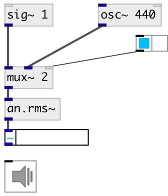

[index](index.html) :: [an](category_an.html)
---

# an.rms~

###### root mean square with moving-average algorithm.

*available since version:* 0.9.1

---

## arguments:

* **PERIOD**
averaging frame 
_type:_ float 
_units:_ ms 

## methods:

* **reset**
clear averaging data 

## properties:

* **@period** 
Get/set averaging frame 
_type:_ float 
_range:_ 1..1000 
_default:_ 200 

* **@active** 
Get/set on/off dsp processing 
_type:_ int 
_enum:_ 0, 1 
_default:_ 1 

## inlets:

* input signal 
_type:_ audio

## outlets:

* rms level 
_type:_ audio

## keywords:

[rms](keywords/rms.html)
[root](keywords/root.html)
[mean](keywords/mean.html)
[square](keywords/square.html)

**Authors:** Serge Poltavsky

**License:** GPL3 or later

