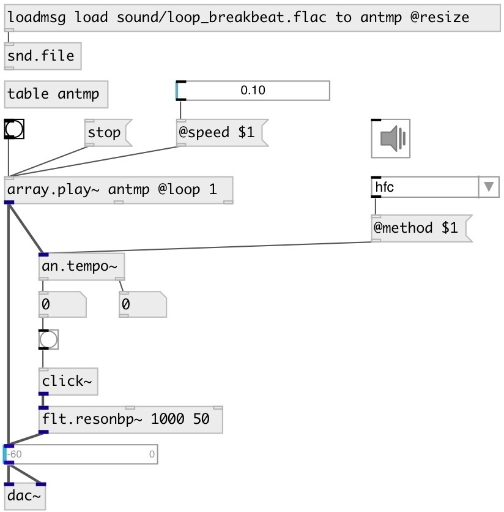

[index](index.html) :: [an](category_an.html)
---

# an.tempo~

###### tempo detector

*available since version:* 0.9.3

---

## information
Tempo detector based on aubio library

## arguments:

* **BS**
buffer size 
__type:__ int 
__units:__ samp 

* **METHOD**
onset detection method 
__type:__ symbol 

* **HS**
hop size (by default buffer_size/2) 
__type:__ int 

## properties:

* **@bs** 
Get/set buffer size 
__type:__ int 
__units:__ samp 
__min value:__ 64 
__default:__ 1024 

* **@hs** 
Get/set hop size. 0 means @bs/2 
__type:__ int 
__units:__ samp 
__min value:__ 0 
__default:__ 0 

* **@method** 
Get/set onset method. Default is hfc. 
__type:__ symbol 
__enum:__ specflux, phase, energy, hfc, kl, complex, default, specdiff, wphase, rolloff, spread, kurtosis, skewness, complexdomain, decrease, slope, centroid 
__default:__ default 

* **@hfc** 
Get/set alias to @method hfc. High Frequency Content onset detection 
__type:__ alias 

* **@energy** 
Get/set alias to @method energy. Energy based onset detection function 
__type:__ alias 

* **@complex** 
Get/set alias to @method complex. Complex Domain Method onset detection function 
__type:__ alias 

* **@phase** 
Get/set alias to @method phase. Phase Based Method onset detection function 
__type:__ alias 

* **@wphase** 
Get/set alias to @method phase.Weighted Phase Deviation onset detection function 
__type:__ alias 

* **@specdiff** 
Get/set alias to @method specdiff. Spectral difference method onset detection function 
__type:__ alias 

* **@kl** 
Get/set alias to @method kl. Kullback-Liebler onset detection function 
__type:__ alias 

* **@mkl** 
Get/set alias to @method mkl. Modified Kullback-Liebler onset detection function 
__type:__ alias 

* **@specflux** 
Get/set alias to @method specflux. Spectral Flux 
__type:__ alias 

* **@threshold** 
Get/set peak picking threshold 
__type:__ float 
__default:__ 0.3 

* **@silence** 
Get/set onset detection silence threshold 
__type:__ float 
__units:__ db 
__range:__ -90..0 
__default:__ -90 

* **@delay** 
Get/set constant system delay to take back from detection time 
__type:__ float 
__units:__ ms 
__min value:__ 0 
__default:__ 0 

* **@active** 
Get/set audio processing state 
__type:__ int 
__enum:__ 0, 1 
__default:__ 1 

## inlets:

* input signal 
__type:__ audio 

## outlets:

* bang if onset detected
__type:__ control 
* output time of the latest onset detected in millisecond
__type:__ control 

## keywords:

[tempo](keywords/tempo.html)
[aubio](keywords/aubio.html)
[bpm](keywords/bpm.html)

**Authors:** Serge Poltavsky

**License:** GPL3 or later

