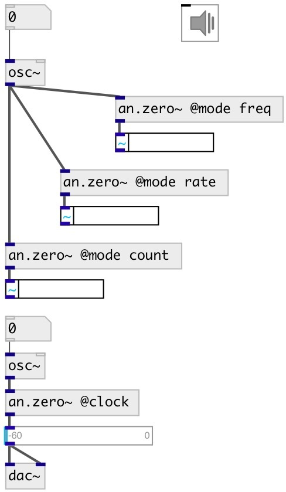

[index](index.html) :: [an](category_an.html)
---

# an.zero~

###### zero crossing count/rate/freq calculator

*available since version:* 0.9.5

---

## properties:

* **@bs** (initonly)
Get/set buffer size 
_type:_ int 
_units:_ samp 
_range:_ 1..65536 
_default:_ 1024 

* **@mode** 
Get/set calculation mode: if &#39;count&#39; - output number of zero crossing occured in a
period of current block size, if &#39;rate&#39; - output zero crossing rate (zero
crossing number / block size), if &#39;freq&#39; - output zero crossing frequency in
hertz. 
_type:_ symbol 
_enum:_ count, rate, freq 
_default:_ count 

* **@clock** (initonly)
Get/set alias for @mode count @bs 1. Output impulse at each zero crossing. 
_type:_ list 
_default:_ 0 

## inlets:

* input signal 
_type:_ audio

## outlets:

* output zero crossing count/freq/rate 
_type:_ audio

## keywords:

[zero](keywords/zero.html)
[crossing](keywords/crossing.html)
[rate](keywords/rate.html)
[count](keywords/count.html)
[freq](keywords/freq.html)

**See also:**
[\[an.pitchtrack~\]](an.pitchtrack~.html)

**Authors:** Serge Poltavsky

**License:** GPL3 or later

