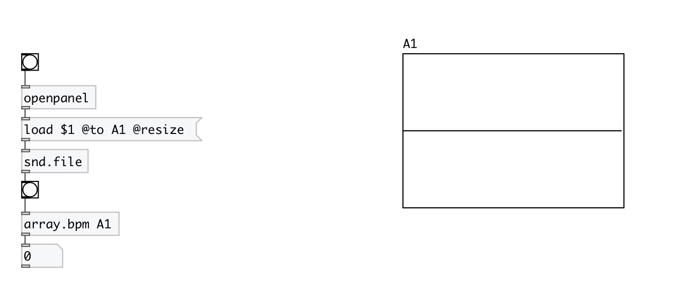

[< reference home](index.html)
---

# array.bpm

BPM calculator

---

Calculates BPM (Beats Per Minute) rate using SoundTouch library
 

---

---
arguments:

ARRAY: array name 

---
properties:

@array: array name 

