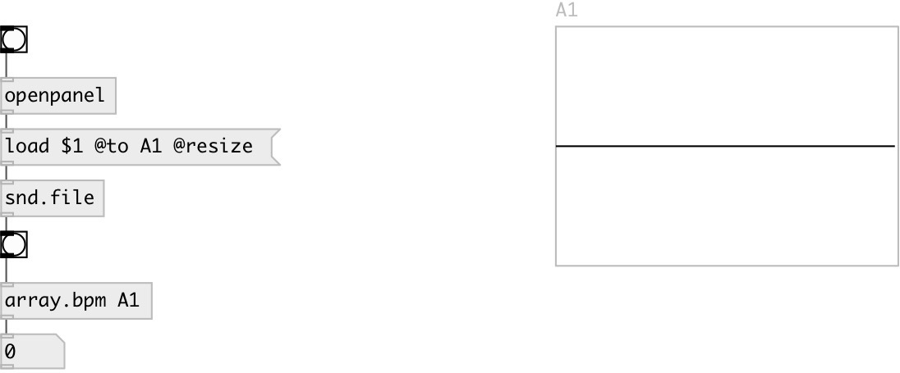

[index](index.html) :: [array](category_array.html)
---

# array.bpm

###### BPM calculator

*available since version:* 0.4

---

## information
Calculates BPM (Beats Per Minute) rate using SoundTouch library

## arguments:

* **ARRAY**
array name 
__type:__ symbol 

## properties:

* **@array** 
Get/set array name 
__type:__ symbol 

## inlets:

* starts calculation 
__type:__ control 

## outlets:

* float value - BPM
__type:__ control 

## keywords:

[array](keywords/array.html)
[bpm](keywords/bpm.html)

**Authors:** Olli Parviainen, Serge Poltavsky

**License:** GPL3 or later

