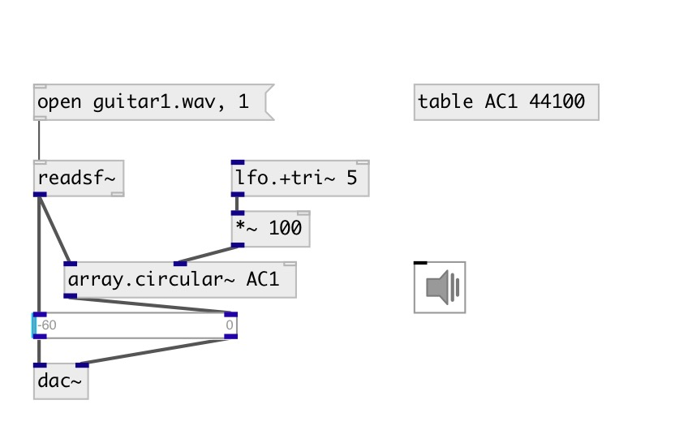

[index](index.html) :: [array](category_array.html)
---

# array.circular~

###### circular buffer for arrays

*available since version:* 0.9.4

---

## arguments:

* **ARRAY**
array name 
_type:_ symbol 

## methods:

* **resize**
resize target array 
  __parameters:__
  - **SZ** new size 
    type: int  
    units: samp  
    required: True  

## properties:

* **@array** 
Get/set array name 
_type:_ symbol 

* **@on** 
Get/set write mode 
_type:_ int 
_enum:_ 0, 1 
_default:_ 1 

* **@interp** 
Get/set interpolation mode 
_type:_ int 
_enum:_ 0, 1, 3 
_default:_ 0 

## inlets:

* write delay 
_type:_ audio
* read delay 
_type:_ audio
* reset write position to zero 
_type:_ audio

## outlets:

* read signal 
_type:_ audio

## keywords:

[array](keywords/array.html)
[circular](keywords/circular.html)
[ring](keywords/ring.html)

**Authors:** Serge Poltavsky

**License:** GPL3 or later

