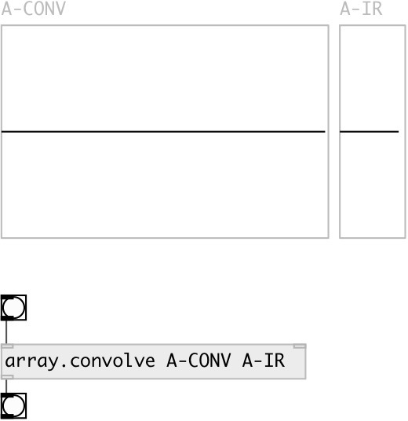

[index](index.html) :: [array](category_array.html)
---

# array.convolve

###### array FFT convolution

*available since version:* 0.9.5

---

## arguments:

* **ARRAY**
target array 
_type:_ symbol 

* **IR**
array with impulse response 
_type:_ symbol 

## properties:

* **@array** 
Get/set target array 
_type:_ symbol 

* **@ir** 
Get/set impulse response array 
_type:_ symbol 

* **@norm** 
Get/set impulse response array 
_type:_ bool 
_default:_ 0 

## inlets:

* start convolution process 
_type:_ control
* set array name 
_type:_ control

## outlets:

* bang: on done 
_type:_ control

## keywords:

[array](keywords/array.html)
[fft](keywords/fft.html)
[convolution](keywords/convolution.html)

**Authors:** Serge Poltavsky

**License:** GPL3 or later

