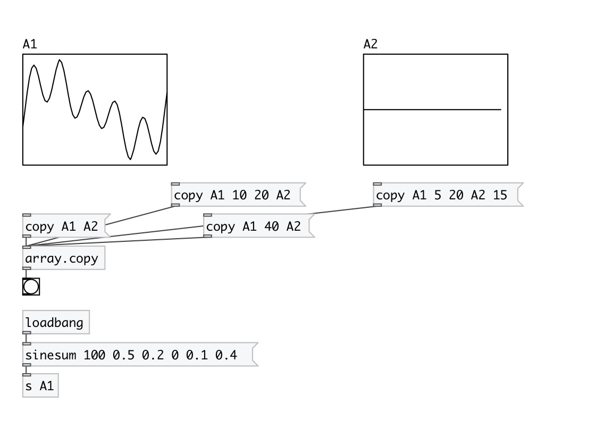

[< reference home](index.html)
---

# array.copy

copy samples from one array to another

---

 

---

---
arguments:

---
properties:

@resize: resize of destination array
            on overflow 

---
see also: 

