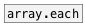

[<<< reference home](ceammc_lib.md)
---

# array.copy

```


[array A1 size=100 w=130 h=100] [array A2 size=20 w=130 h=100]


              [copy A1 10 20 A2( [copy A1 5 20 A2 15(
              |                  |
[copy A1 A2(  |  [copy A1 40 A2( |
|             |  |               |
[array.copy                      ]
|
[B]

[loadbang]
|
[sinesum 100 0.5 0.2 0 0.1 0.4(
|
[s A1]

            
```
---
copy samples from one array to another
---
arguments:


---
properties:

@resize: resize of destination array
            on overflow<br>

---
see also:<br>
[](array.each.md)
