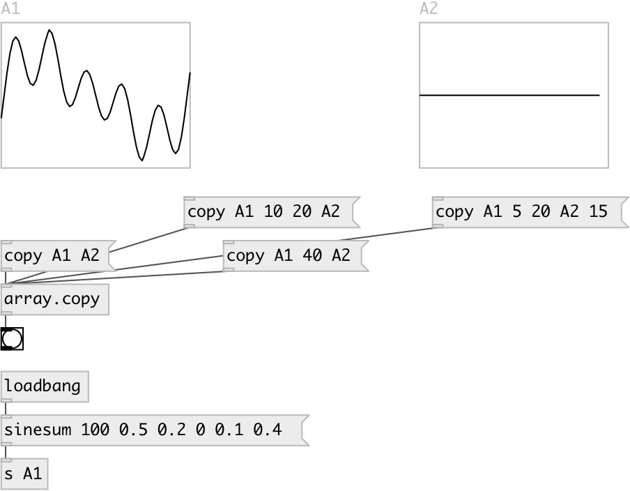

[index](index.html) :: [array](category_array.html)
---

# array.copy

###### copy samples from one array to another

*available since version:* 0.3

---

## methods:

* **copy**
copy whole array content 
  __parameters:__
  - **SRC** name of source array 
    type: symbol  
    required: True  

  - **DEST** name of destination array 
    type: symbol  
    required: True  

* **copy**
copy array content from specified position till end 
  __parameters:__
  - **SRC** name of source array 
    type: symbol  
    required: True  

  - **FROM** source start position 
    type: int  
    required: True  

  - **DEST** name of destination array 
    type: symbol  
    required: True  

* **copy**
copy array content from specified range 
  __parameters:__
  - **SRC** name of source array 
    type: symbol  
    required: True  

  - **FROM** source start range 
    type: int  
    required: True  

  - **TO** source end range 
    type: int  
    required: True  

  - **DEST** name of destination array 
    type: symbol  
    required: True  

* **copy**
copy array content from specified range and to specified destination position 
  __parameters:__
  - **SRC** name of source array 
    type: symbol  
    required: True  

  - **FROM** source start range 
    type: int  
    required: True  

  - **TO** source end range 
    type: int  
    required: True  

  - **DEST** name of destination array 
    type: symbol  
    required: True  

  - **DEST_FROM** destination start position 
    type: int  
    required: True  

## properties:

* **@resize** 
Get/set resize of destination array on overflow 
_type:_ bool 
_default:_ 0 

## inlets:

* FROM, TO - copy data from one array to another 
_type:_ control

## outlets:

* bang on finish 
_type:_ control

## keywords:

[array](keywords/array.html)
[copy](keywords/copy.html)

**See also:**
[\[array.each\]](array.each.html)

**Authors:** Serge Poltavsky

**License:** GPL3 or later

