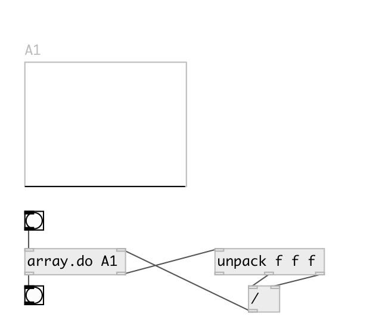

[index](index.html) :: [array](category_array.html)
---

# array.do

###### iterate and modify array content via side-chain

*available since version:* 0.3

---

## arguments:

* **ARRAY**
array name 
_type:_ symbol 

## properties:

* **@array** 
Get/set array name 
_type:_ symbol 

* **@redraw** 
Get/set redraw after array change 
_type:_ bool 
_default:_ 1 

## inlets:

* starts iteration 
_type:_ control
* sample value from side-chain 
_type:_ control

## outlets:

* bang on finish 
_type:_ control
* for each array sample outputs list: SAMPLE_VALUE, SAMPLE_POS, TOTAL_SAMPLES 
_type:_ control

## keywords:

[array](keywords/array.html)
[do](keywords/do.html)

**See also:**
[\[array.each\]](array.each.html)

**Authors:** Serge Poltavsky

**License:** GPL3 or later

