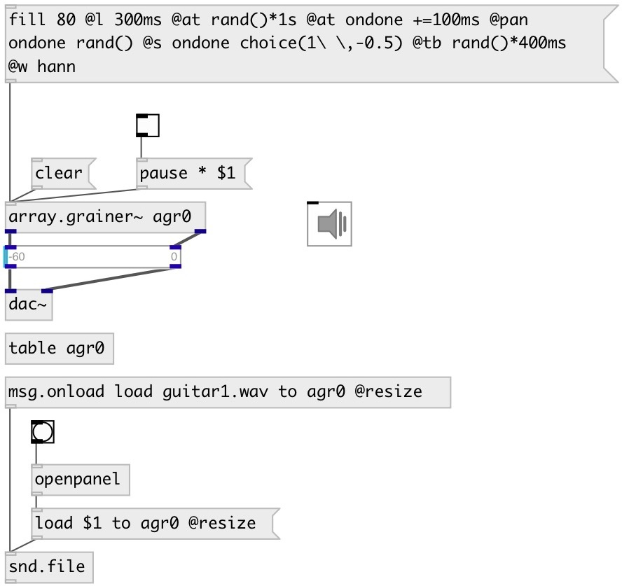

[index](index.html) :: [array](category_array.html)
---

# array.grainer~

###### array granulator

*available since version:* 0.9.2

---

## information
Grain properties: @at - grain position in source array (in samples) @l - grain length (in samples) @amp - grain amplitude in 0..256 range @s - grain speed in -10..10 range @p - grain pan in 0..1 range @w - grain window: rect, tri or hann @tb - time before grain start (in samples) @ta - time after grain done (in samples) @r - grain number of repeats (-1: infinite) @tag - grain tag

## arguments:

* **NAME**
array name 
_type:_ symbol 

## methods:

* **clear**
remove grain(s) 
  __parameters:__
  - **[SUBJ]** if &#39;*&#39; or ommited: remove all grains, if &#39;.&#39;: remove finished grains only, if float: remove grain with corresponding #id, if symbol: remove grains with corresponding tag 
    type: atom  

* **set**
set grain(s) properties 
  __parameters:__
  - **SUBJ** if &#39;*&#39;: set for all grains, if float: set for grain with specified #id, if symbol: set for grains with specified tag 
    type: atom  
    required: True  

  - **PROPS** grain properties 
    type: list  
    required: True  

* **grain**
create single grain 
  __parameters:__
  - **PROPS** grain properties 
    type: list  
    required: True  

* **append**
append several grains 
  __parameters:__
  - **N** number of grains 
    type: int  
    required: True  

  - **PROPS** grain properties 
    type: list  
    required: True  

* **fill**
fill with grains (remove all existing grains before) 
  __parameters:__
  - **N** number of grains 
    type: int  
    required: True  

  - **PROPS** grain properties 
    type: list  
    required: True  

* **onsets**
analyze source array for onsets 
  __parameters:__
  - **[METHOD=default]** onset detection method 
    type: symbol  

  - **[SPACE=64]** minimal space between onsets 
    type: float  
    units: ms  

  - **[SILENCE=-40]** silence level 
    type: float  
    units: db  

* **align**
align gain(s) to onset 
  __parameters:__
  - **[SUBJ]** if &#39;*&#39; or ommited: align all grains, if &#39;.&#39;: align finished grains only, if float: align grain with corresponding #id, if symbol: align grains with corresponding tag 
    type: atom  

## properties:

* **@array** 
Get/set array name 
_type:_ symbol 

* **@sync** 
Get/set grain sync mode. If &#39;none&#39;: start grains right after they are finished, if
&#39;int&#39;: start grains after specified interval (@tsync). 
_type:_ symbol 
_enum:_ none, int, ext 
_default:_ none 

* **@tsync** 
Get/set grain sync interval 
_type:_ float 
_units:_ ms 
_min value:_ 1 
_default:_ 50 

* **@prob** 
Get/set grain start probability in internal or external sync mode. (&#39;int&#39; or &#39;ext&#39;) 
_type:_ float 
_range:_ 0..1 
_default:_ 1 

## inlets:

* control inlet 
_type:_ control

## outlets:

* left output 
_type:_ audio
* right output 
_type:_ audio

## keywords:

[array](keywords/array.html)
[grain](keywords/grain.html)
[particle](keywords/particle.html)
[granular](keywords/granular.html)

**See also:**
[\[array.each\]](array.each.html)

**Authors:** Serge Poltavsky

**License:** GPL3 or later

