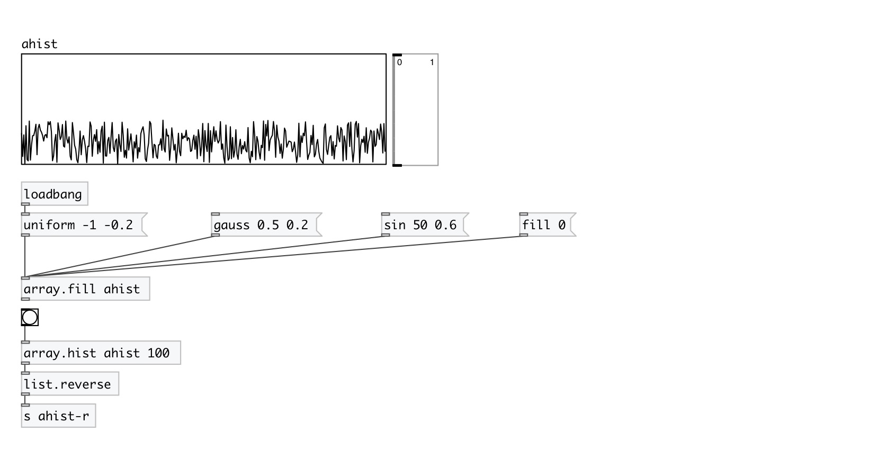

[< reference home](index.html)
---

# array.hist

calculates array histogram

---

Values outside of range @min...@max are ignored
 

---

---
arguments:

NAME: array name 
BINS: number of bins 
MIN: minimal value 
MAX: maximum value 

---
properties:

@array: array name 
@bins: number of
            bins 
@min: minimal value 
@max: maximum value 

---
see also: 

