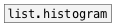

[<<< reference home](ceammc_lib.md)
---

# array.hist

```


[array ahist size=512 w=330 h=100] [ui.sliders @size 40 100 @receive ahist-r @auto_range 1]


[loadbang]
|
[uniform -1 -0.2( [gauss 0.5 0.2( [sin 50 0.6( [fill 0(
|                 |               |            |
|                 |               |            |
|                 |               |            |
[array.fill ahist                              ]

[B]
|
[array.hist ahist 100]
|
[list.reverse]
|
[s ahist-r]

            
```
---
calculates array histogram
---
arguments:

NAME: array name<br>
BINS: number of bins<br>
MIN: minimal value<br>
MAX: maximum value<br>

---
properties:

@array: array name<br>
@bins: number of
            bins<br>
@min: minimal value<br>
@max: maximum value<br>

---
see also:<br>
[](list.histogram.md)
