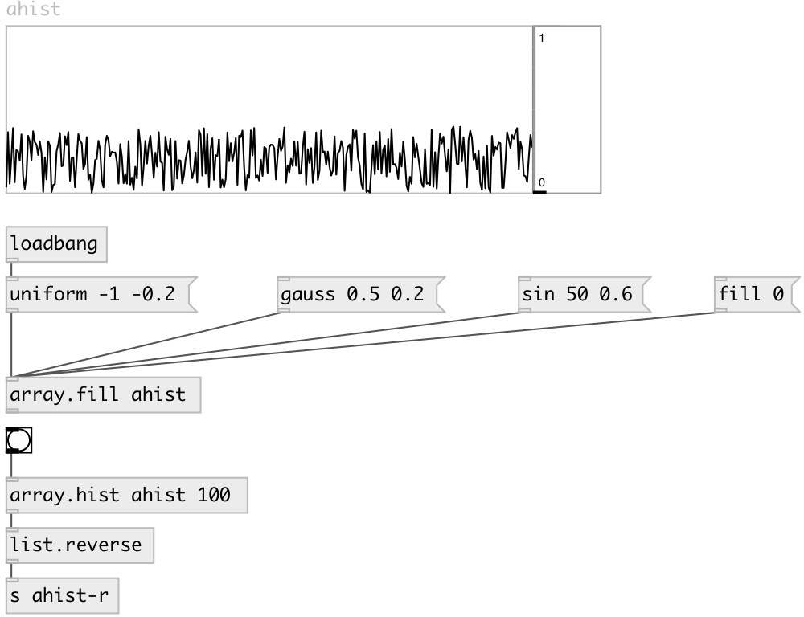

[index](index.html) :: [array](category_array.html)
---

# array.hist

###### calculates array histogram

*available since version:* 0.7.1

---

## information
Values outside of range @min...@max are ignored

## arguments:

* **NAME**
array name 
__type:__ symbol 

* **BINS**
number of bins 
__type:__ int 

* **MIN**
minimal value 
__type:__ float 

* **MAX**
maximum value 
__type:__ float 

## properties:

* **@array** 
Get/set array name 
__type:__ symbol 

* **@bins** 
Get/set number of bins 
__type:__ int 
__range:__ 2..1000 
__default:__ 100 

* **@min** 
Get/set minimal value 
__type:__ float 
__default:__ -1 

* **@max** 
Get/set maximum value 
__type:__ float 
__default:__ 1 

## inlets:

* calculates and outputs histogram 
__type:__ control 

## outlets:

* list of histogram value (length=@bins)
__type:__ control 

## keywords:

[array](keywords/array.html)
[histogram](keywords/histogram.html)

**See also:**
[\[list.histogram\]](list.histogram.html)

**Authors:** Serge Poltavsky

**License:** GPL3 or later

