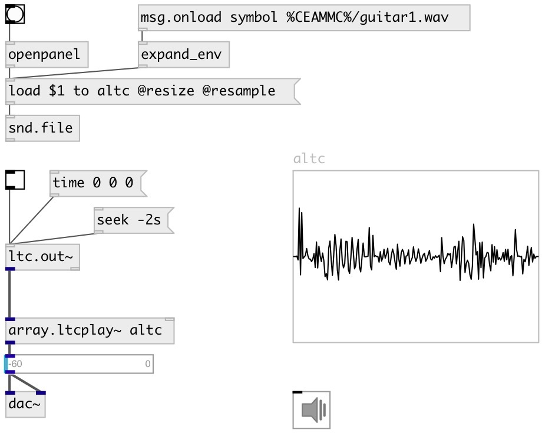

[index](index.html) :: [array](category_array.html)
---

# array.ltcplay~

###### array player controlled by LTC

*available since version:* 0.9.7

---

## arguments:

* **ARRAY**
array name 
_type:_ symbol 

## properties:

* **@array** 
Get/set array name 
_type:_ symbol 

* **@fps** 
Get/set expected LTC stream framerate 
_type:_ atom 
_enum:_ auto, 24, 25, 29.97, 30 
_default:_ auto 

## inlets:

* LTC input signal 
_type:_ audio
* set source array 
_type:_ control

## outlets:

* output 
_type:_ audio

## keywords:

[array](keywords/array.html)
[ltc](keywords/ltc.html)
[play](keywords/play.html)

**Authors:** Serge Poltavsky

**License:** GPL3 or later

