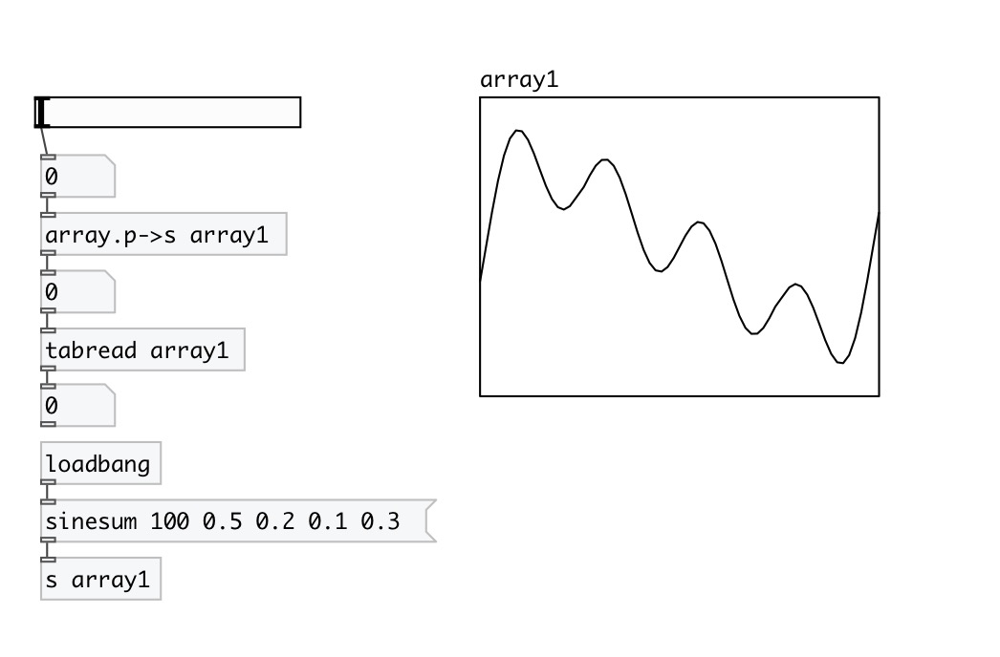

[< reference home](index.html)
---

# array.p2s

convert array phase [0..1] to sample position

---

this object allows to get relative access to array
 

---

---
arguments:

NAME: array name 

---
properties:

@array: array name 

---
see also: 

