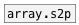

[< reference home](ceammc_lib.html)
---

# array.p2s


convert array phase [0..1] to sample position

---

this object allows to get relative access to array
<br>


---


```


[HS min=0 max=1]       [array array1 size=100 w=200 h=150]
|
[F]
|
[array.p->s array1]
|
[F]
|
[tabread array1]
|
[F]

[loadbang]
|
[sinesum 100 0.5 0.2 0.1 0.3(
|
[s array1]

            
```

---
arguments:

NAME: array name<br>

---
properties:

@array: array name<br>

---
see also:<br>
[](array.s2p.html)
