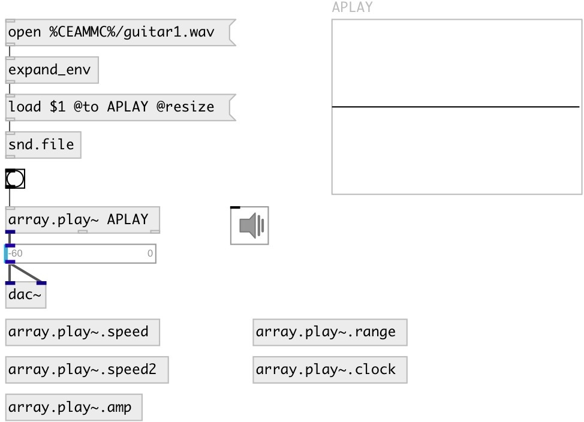

[index](index.html) :: [array](category_array.html)
---

# array.play~

###### array player with variable speed and amplitude

*available since version:* 0.9.1

---

## arguments:

* **ARRAY**
array name 
__type:__ symbol 

* **SPEED**
play speed 
__type:__ float 

## methods:

* **play**
start playback from current play position 

* **stop**
stop playback and reset play position 

* **pause**
pause/resume playback 
  __parameters:__
  - **[anonym=1]** if true: pause, else resume playing 
    type: int  

* **range**
set @begin and @end property 
  __parameters:__
  - **BEGIN** begin position. If float value given: interpret as phase in [0..1] range. Otherwise unit value expected. Examples: 10ms, 5%, 4sec, 20samp etc. 
    type: atom  
    required: True  

  - **END** end position. Value type same as for first argument 
    type: atom  
    required: True  

## properties:

* **@array** 
Get/set array name 
__type:__ symbol 

* **@begin** 
Get/set playback start position. Negative value means position relative to the end of
the array 
__type:__ float 
__units:__ samp 
__default:__ 0 

* **@end** 
Get/set playback end position. Negative value means position relative to the end of the
array 
__type:__ float 
__units:__ samp 
__default:__ -1 

* **@speed** 
Get/set playback speed. Negative value means reversed playback 
__type:__ float 
__default:__ 1 

* **@amp** 
Get/set playback amplitude 
__type:__ float 
__min value:__ 0 
__default:__ 1 

* **@interp** 
Get/set interpolation type. 0: no interpolationm 1: linear, 3: cubic. 
__type:__ int 
__enum:__ 0, 1, 3 
__default:__ 1 

* **@clock** 
Get/set clock output period. Zero means: no clock output (by default). 
__type:__ float 
__units:__ sec 
__range:__ 0..20 
__default:__ 0 

* **@cfmt** 
Get/set clock output format 
__type:__ symbol 
__enum:__ sec, ms, samp, phase 
__default:__ sec 

* **@state** (readonly)
Get playing state. 0: stopped, 1: playing, 2: paused. 
__type:__ int 
__default:__ 0 

* **@cursor_ms** 
Get/set current play position 
__type:__ float 
__units:__ ms 
__default:__ 0 

* **@cursor_sec** 
Get/set current play position 
__type:__ float 
__units:__ sec 
__default:__ 0 

* **@cursor_phase** 
Get/set current play position 
__type:__ float 
__default:__ 0 

* **@cursor_samp** 
Get/set current play position 
__type:__ float 
__units:__ samp 
__default:__ 0 

* **@select_samp** 
Get/set selection range 
__type:__ list 
__units:__ samp 
__default:__ 0 0 

* **@select_ms** 
Get/set selection range 
__type:__ list 
__units:__ ms 
__default:__ 0 0 

* **@select_sec** 
Get/set selection range 
__type:__ list 
__units:__ sec 
__default:__ 0 0 

* **@select_phase** 
Get/set selection range in [0, 1] range 
__type:__ list 
__default:__ 0 0 

## inlets:

* resets play position and starts playback 
__type:__ control 

## outlets:

* played signal
__type:__ audio 
* output current playing position according to @cfmt property. By default output
            seconds
__type:__ control 
* output bang when finished
__type:__ control 

## keywords:

[array](keywords/array.html)
[play](keywords/play.html)

**See also:**
[\[tabplay~\]](tabplay~.html)

**Authors:** Serge Poltavsky

**License:** GPL3 or later

