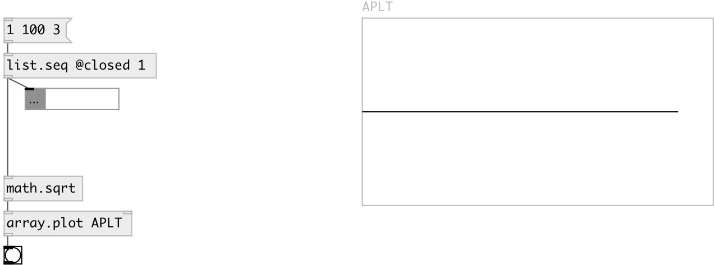

[index](index.html) :: [array](category_array.html)
---

# array.plot

###### array data plotter

*available since version:* 0.9.2

---

## arguments:

* **ARRAY**
array name 
_type:_ symbol 

* **YMIN**
minimal y-axis value 
_type:_ float 

* **YMAX**
maximum y-axis value 
_type:_ float 

## properties:

* **@array** 
Get/set array name 
_type:_ symbol 

* **@ymin** 
Get/set minimal y-axis value 
_type:_ float 
_range:_ -2048..2048 
_default:_ -1 

* **@ymax** 
Get/set maximum y-axis value 
_type:_ float 
_range:_ -2048..2048 
_default:_ 1 

* **@yauto** 
Get/set calculate y-axis range automatically 
_type:_ bool 
_default:_ 1 

* **@nan** 
Get/set value to replace nan on plot 
_type:_ float 
_default:_ +inf 

## inlets:

* single input sample 
_type:_ control
* plot all samples fitted to specified array 
_type:_ control

## outlets:

* bang on done 
_type:_ control

## keywords:

[array](keywords/array.html)
[plot](keywords/plot.html)

**See also:**
[\[array.plot~\]](array.plot~.html)

**Authors:** Serge Poltavsky

**License:** GPL3 or later

