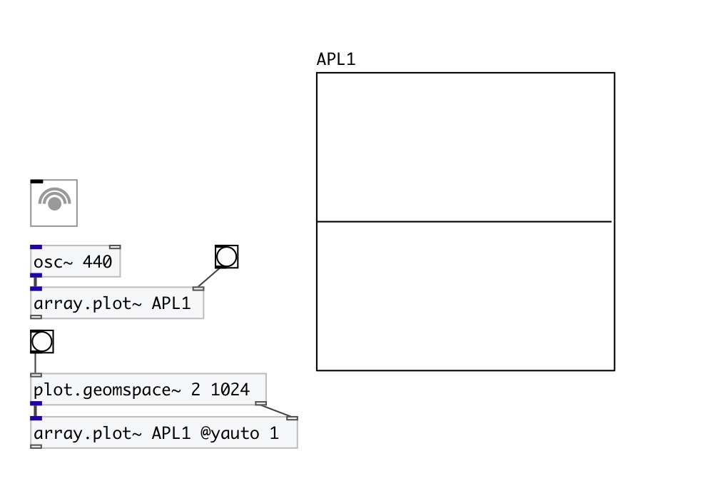

[< reference home](index.html)
---

# array.plot~

plot signal on specified array

---

 

---

---
arguments:

---
properties:

@array: array name 
@ymin: 
            minimal y-axis value 
@ymax: 
            minimal y-axis value 
@yauto: calculate y-axis range
            automatically 

---
see also: 

