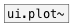

[< reference home](index.html)
---

# array.plot~


plot signal on specified array

---

<br>


---


```


                    [array APL1 size=100 w=200 h=200]


[ui.dsp~]


[osc~ 440]   [B]
|            |.
[array.plot~ APL1]

[B]
|
[plot.geomspace~ 2 1024]
|   ^|.
[array.plot~ APL1 @yauto 1]

            
```

---
arguments:


---
properties:

@array: array name<br>
@ymin: 
            minimal y-axis value<br>
@ymax: 
            minimal y-axis value<br>
@yauto: calculate y-axis range
            automatically<br>

---
see also:<br>
[](ui.plot~.html)
