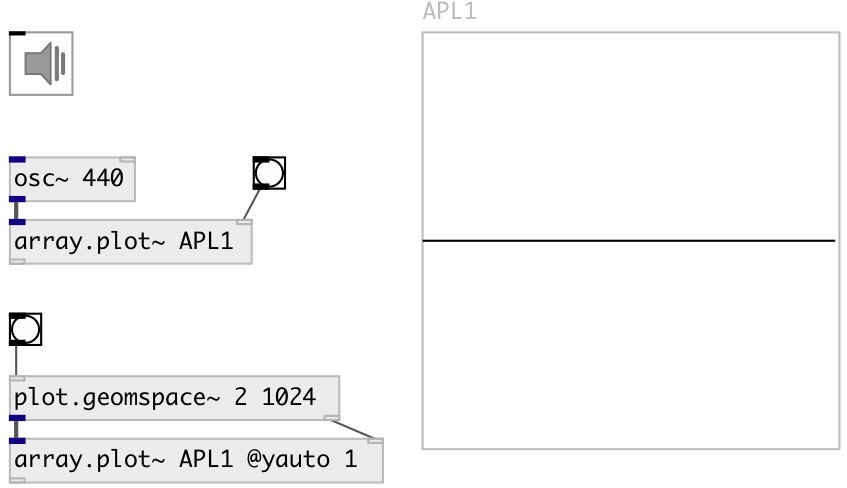

[index](index.html) :: [array](category_array.html)
---

# array.plot~

###### plot signal on specified array

*available since version:* 0.9

---

## arguments:

* **ARRAY**
array name 
_type:_ symbol 

* **YMIN**
minimal y-axis value 
_type:_ float 

* **YMAX**
maximum y-axis value 
_type:_ float 

## properties:

* **@array** 
Get/set array name 
_type:_ symbol 

* **@ymin** 
Get/set minimal y-axis value 
_type:_ float 
_range:_ -1024..1024 
_default:_ -1 

* **@ymax** 
Get/set minimal y-axis value 
_type:_ float 
_range:_ -1024..1024 
_default:_ 1 

* **@yauto** 
Get/set calculate y-axis range automatically 
_type:_ bool 
_default:_ 0 

## inlets:

* input signal 
_type:_ audio
* plot all samples fitted to specified array 
_type:_ control

## keywords:

[array](keywords/array.html)
[plot](keywords/plot.html)

**See also:**
[\[ui.plot~\]](ui.plot~.html)
[\[array.plot\]](array.plot.html)

**Authors:** Serge Poltavsky

**License:** GPL3 or later

